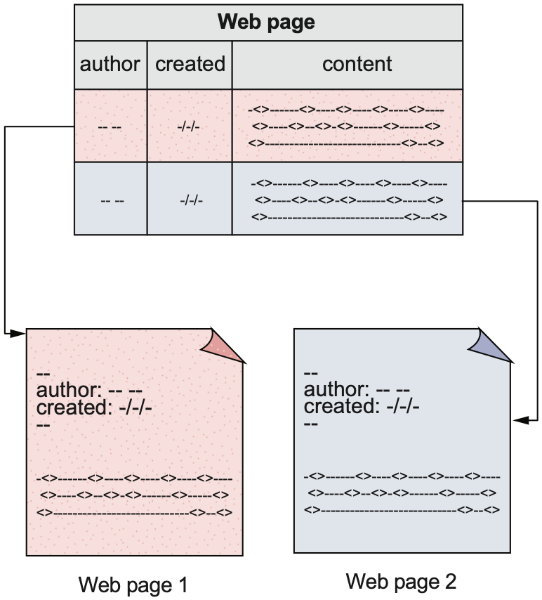
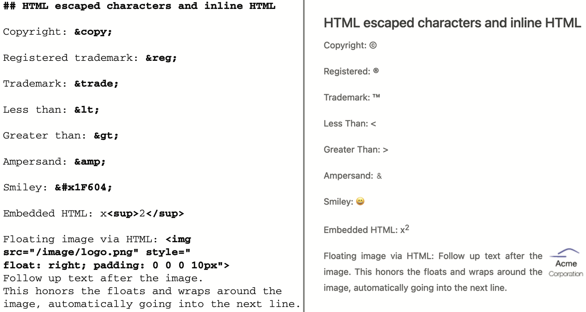
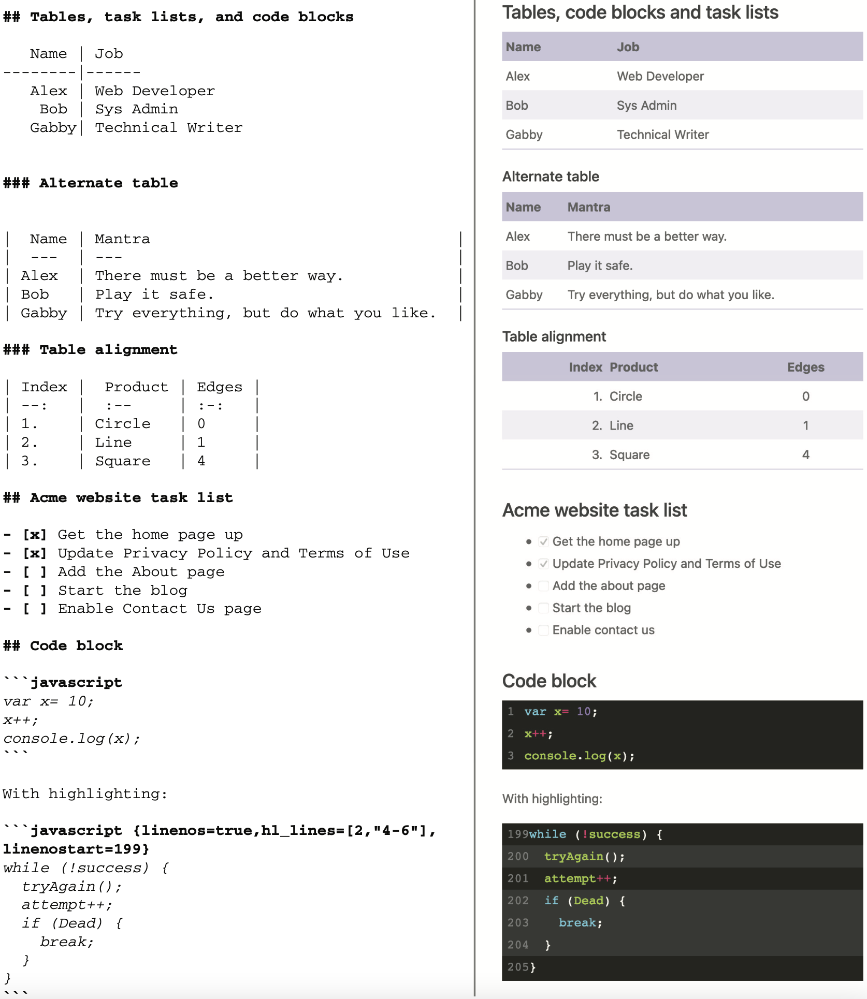
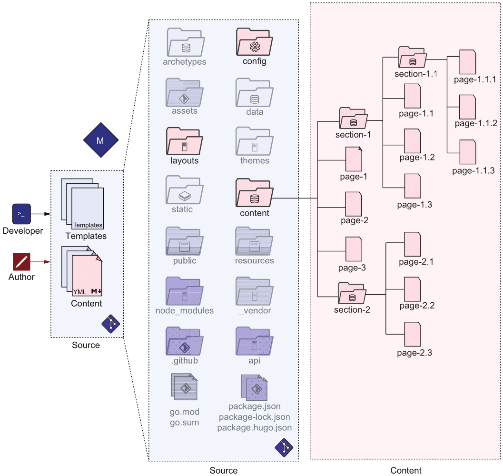
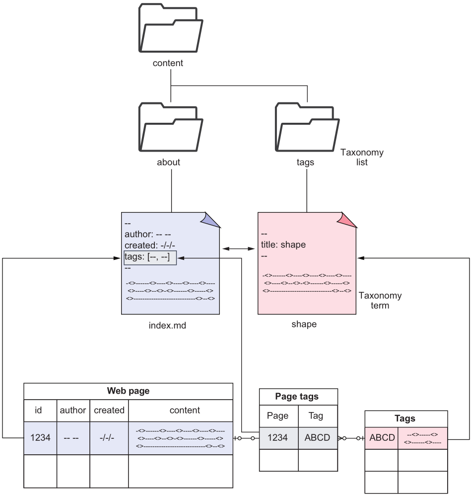
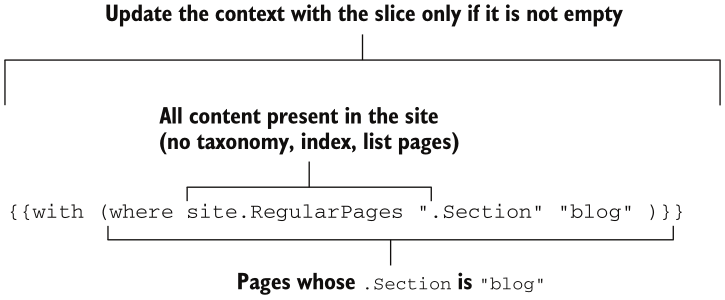

# 常用命令

关闭缓存

```shell
$ hugo server -DEF --noHTTPCache --disableFastRender
```

# _index.md 和 index.md 的区别

[参考](https://gohugo.io/content-management/page-bundles/)

- _index.md: branch bundle, 该会展示该目录下的资源
- index.md: leaf bundle, 只展示该 index.md

# Front Matter

就是在 md 文件开头, 用于描述元信息的数据, 可以是 yaml, json 等

[参考](https://gohugo.io/content-management/front-matter/#front-matter-variables)

```yaml
---
title: "Study Hugo"
date: 2022-07-21T22:14:25+08:00
draft: false
---
```

# jam 含义


- m: Markup, 注意区分 markdown
- j: Javascript
- a: APIs

结合例图来看, Hugo 用 M 和 A (其实是 js, 这里表示应用逻辑) 生成静态文件, 通过 CDN 分发到 Client 后, 可以通过 js
生成动态内容甚至是访问由云提供商开放的 API.

这个 stack 使得用户的维护工作变得很少.

# 目录结构


- archetypes 存放模板
- content 存放数据
- data 存储结构化数据
- layouts 覆盖 theme 的一部分来自定义主题
- themes 渲染 content 中的内容的样式文件
- config Hugo 支持多配置文件, 这时需要组织到一个目录中
- static 建议将内容放到 content, data, themes, layouts 目录中, 而不是 static
    - e.g. 二进制文件, 用于下载的文件
- assets img, js, css
- public Hugo 编译结果输出目录
- resources 相当于缓存目录, 提高编译速度
    - 书中建议版本化该目录, 但是我认为没必要
- go.mod, go.sum Hugo Modules 需要这些文件来管理依赖
- vendor Hugo Modules 用到的第三方依赖
- node_modules, package.json, package-lock.json, package.hugo.json Hugo 和 JS 的集成所用到的文件
- .github, netlify.toml Hugo 持续集成服务所需文件
- api 存放自定义 API

# assets 和 static 的区别

- assets 存放一些需要 Hugo 处理的文件 (Hugo Pipes)
- static 存放不需要 Hugo 处理的文件

# Markdown




- [原始 Markdown 的扩展](https://commonmark.org/ "test tooltip")
- [GFM](https://github.github.com/gfm/) 在扩展之上的 Markdown 变体

Hugo 支持 `.md` `.markdown` 扩展名.

## 语法

启用内联 HTML

```yaml
markup:
  goldmark:
    renderer:
      unsafe: true
```

启用行号

```yaml
markup:
  highlight:
    lineNos: true
```

启用 emoji

- [emoji名字](https://www.unicode.org/emoji/charts/emoji-list.html)

```yaml
# config.yaml
enableEmoji: true
```

使用 emoji

```
:smile:
```






# 内容管理



## 配置管理

如果只用一个配置文件, 那么不能区分开发/生产环境.

## Sections

section 对应 url 路径的一节, 比如 `https://example.org/blog/community/welcome` 中包含 blog, community.
不仅 welcome 可访问, blog 也有 index page 来展示 blog 下的内容的列表.

`content` 目录就是根 section, 可以用 `_index.md` 实现 homepage, 如果使用了主题, 那么在 `_index.md` 中使用
front matter 是不生效的.
- 只有 content section 的 `_index.md` 是可选的

如果想展示目录中的内容, 必须在该目录下创建一个名为 `_index.md` 的空文件, 使该目录成为 section, Hugo 不会自动把目录
变为 section.

## 图片应该放到哪里

- 如果是与 page 相关的, 应该放到与其相关的 page bundle 中
- assets 中的图片会被 HUgo 处理和优化
- static 中的图片用于原样返回

放在 assets 或 static 中的图片可以被重用来节省带宽或存储

## Branch 和 Leaf 的区别


## Headless hundles

是 leaf bundle 中 front matter 的一个配置字段 `headless: true`

- 不会被渲染

## Taxonomies



## Shortcodes

shortcodes 是一个小模板, 相当于编程语言中的函数.

使用例子


另一种插入代码的方式

if (!tired()) {
    keepCoding();
}
else {
    drinkCoffee();
}


嵌入的 shortcodes



    


内建 shortcodes
- gist: GitHub gist
- ref: 引用 Hugo 站点内的文件的绝对连接
- relref: 引用 Hugo 站点内的文件的相对连接
- figure: 使图片带有标题
- tweet: 显示一条 tweet
- instagram: 嵌入一个 instagram 图片
- vimeo: Vimeo video
- youtube
- highlight: syntax highlighting
- param: debug 用

### HTML shortcodes


使用 divider


### Markup-based shortcodes

{}

### Inline shortcodes

因为有安全问题, 所以该特性默认关闭 `enableInlineShortcodes: false`

定义 inline

- hah my inline


以 markup 解析
{}

以 html 解析


# 分离数据和界面

## Go template language

在 Go template 中可以通过变量访问内容
- `$`: 模板上下文
  - `$.Title`
  - `$.Description`
  - `$.Page.Title`
- `site`: 访问 config.yaml 中的配置
  - `site.Pages`
  - `site.Taxonomies`
  - `site.Params`
- `hugo`: 访问 Hugo compiler
  - `hugo.IsProduction`

### if 语句

```html
{{if $.Description}}
abc
{{end}

{{if $.Title}}
    <title>{{$.Title}}</title>
{{else if site.Title}}
    <title>{{site.Title}}</title>
{{end}}
```

### 变量

```html
{{$title := $.Title}}

{{if not $title}}
{{$title = site.Title}}
{{end}}
```

### 使用 Hugo 库函数

带有默认值的声明
```html
{{$title:= default site.Title $.Title}}

可以使用括号
{{$title:= (default site.Title $.Title)}}

检查变量是否定义
{{if isset $.Params "subtitle"}}<h2>{{$.Params.subtitle}}</h2>{{end}}
```

`$.Param` 函数(注意没有`s`), 当所访问的页变量不存在时, 使用站点变量

```html
{{$.Param "subtitle"}}
```

开头字母大写
```html
{{with .Param "subtitle"}}<h2>{{humanize .}}</h2>{{end}}
```

where 函数
- 参数: slice, key, value



### 上下文变量 `.`

```html
{{with $title}}<title>{{.}}</title>{{end}}
```

在 with 中使用 `$` 可访问顶级变量

### 管道

- markdownify: 将内容解释为 markdown
```html
{{with .Param "subtitle"}}<h2>{{. | humanize | markdownify}}</h2>{{end}}
```

## 使用结构化数据

Hugo 支持解析
- csv
- json
- yaml

data文件夹中的数据可以通过 `site.Data` 变量访问. 或者使用 `readFile` 获取原始文本, 然后使用
`transform.Unmarshal` 将数据转换为 dictionary.

Page bundles 中的资源可用通过 `$.Page.Resources.Get` 获取.

测试 `price` shortcode

  


### Archetypes

相当于 post 模板, 能够创建目录结构, 填充 front matter, 占位图片.
`hugo new <filename>` 会根据模板创建所需内容.

还可以在 `archetypes` 中创建 page bundles 模板
`hugo new blog/line --kind blog`

# 结构化 Pages

## context type

context type 类似 theme, 但是不渲染全部网站, 只用于渲染 section 或 page.
- context type 是 templates 的集合
- theme 是 content types 的集合
- layouts 中的 index.html 可以覆盖默认的 index template
- Hugo 支持覆盖任何 theme template (layouts 覆盖对应 theme/layouts 路径中的文件)

## base template

`baseof.html` 定义了渲染框架

四种布局

- list layout: 渲染 branch bundle
- single layout: 渲染 leaf bundle
- index layout: 渲染 homepage, 如果不存在则使用 list layout
- 404 layout: 渲染所有的错误页
  - 可以自定义其他错误码
  - 由于使用了 Jamstack, 5xx错误是不需要的

使用的原理是 baseof.html + 某种布局

- 如果某种布局使用了 `define` 并且覆盖了 baseof.html 中的 `block`, 那么将替换默认 block