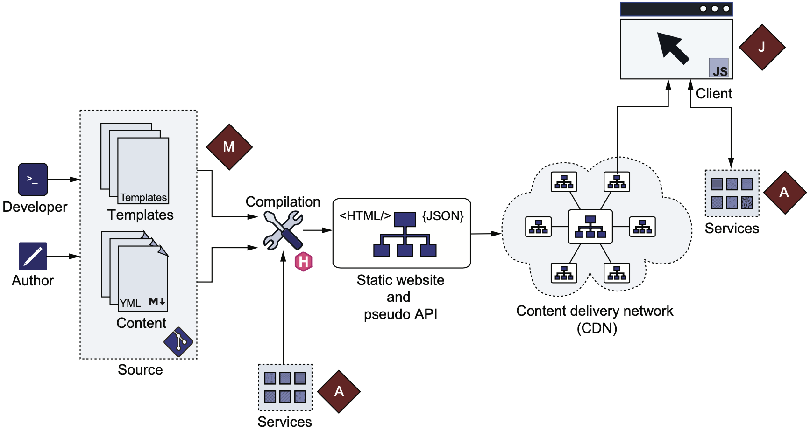
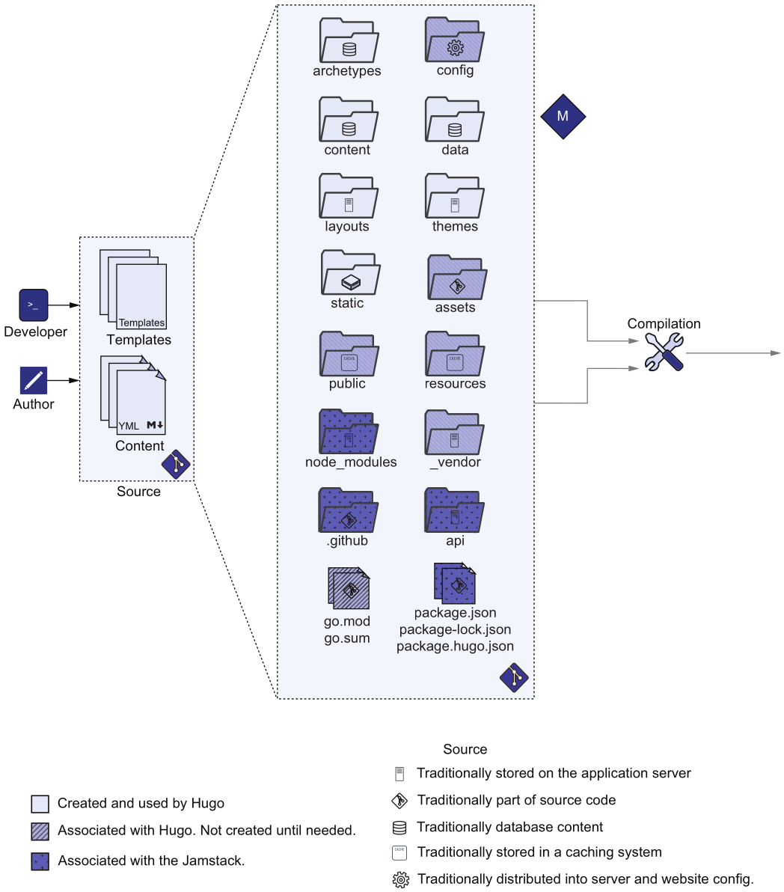
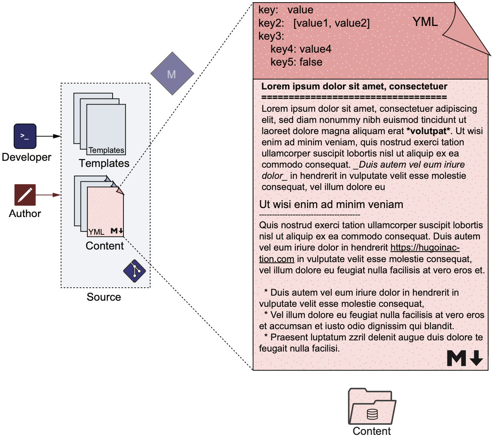
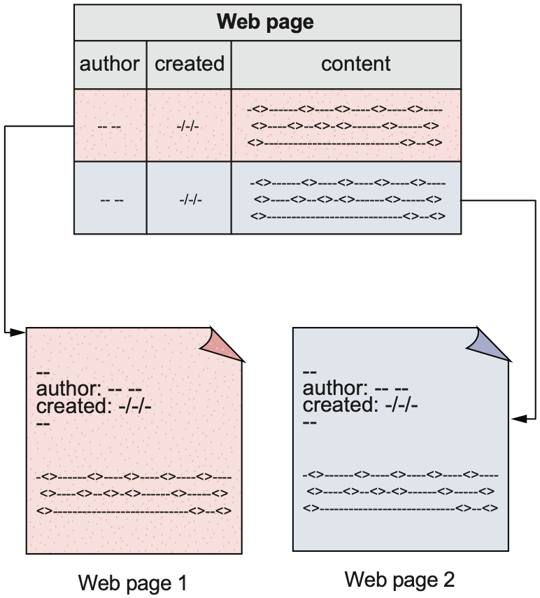
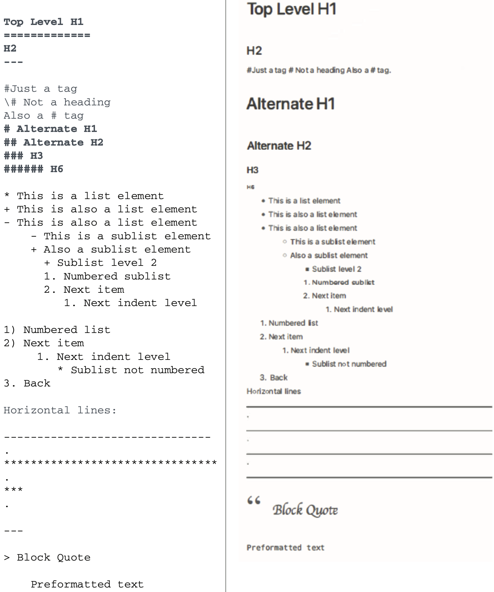
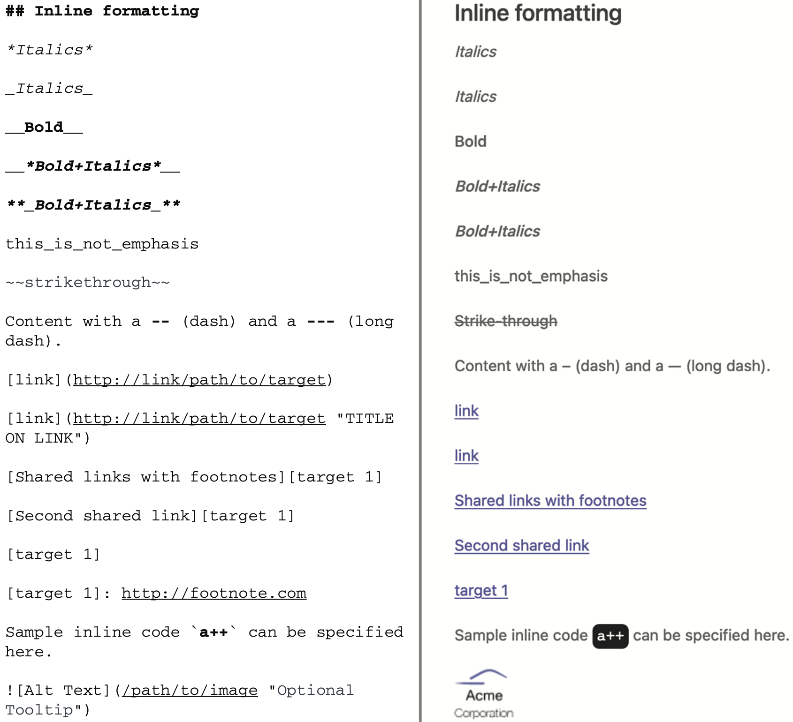
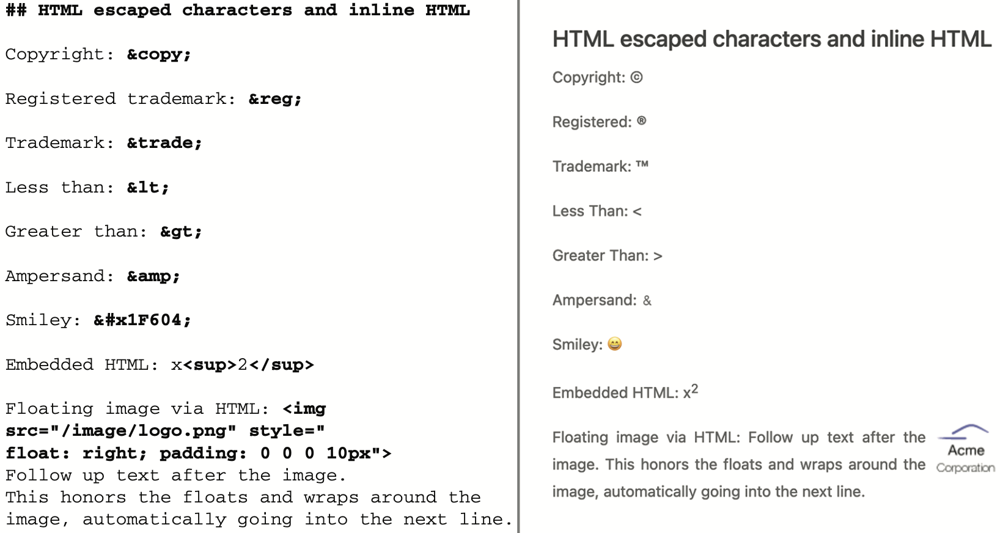
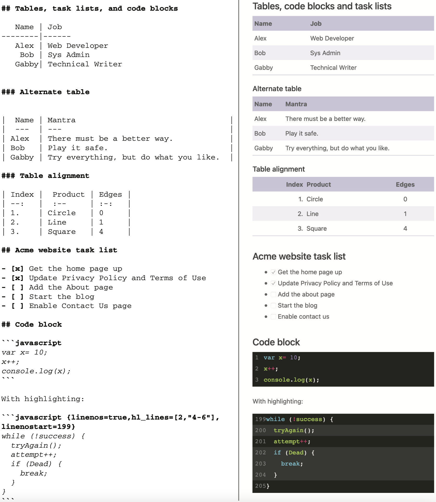
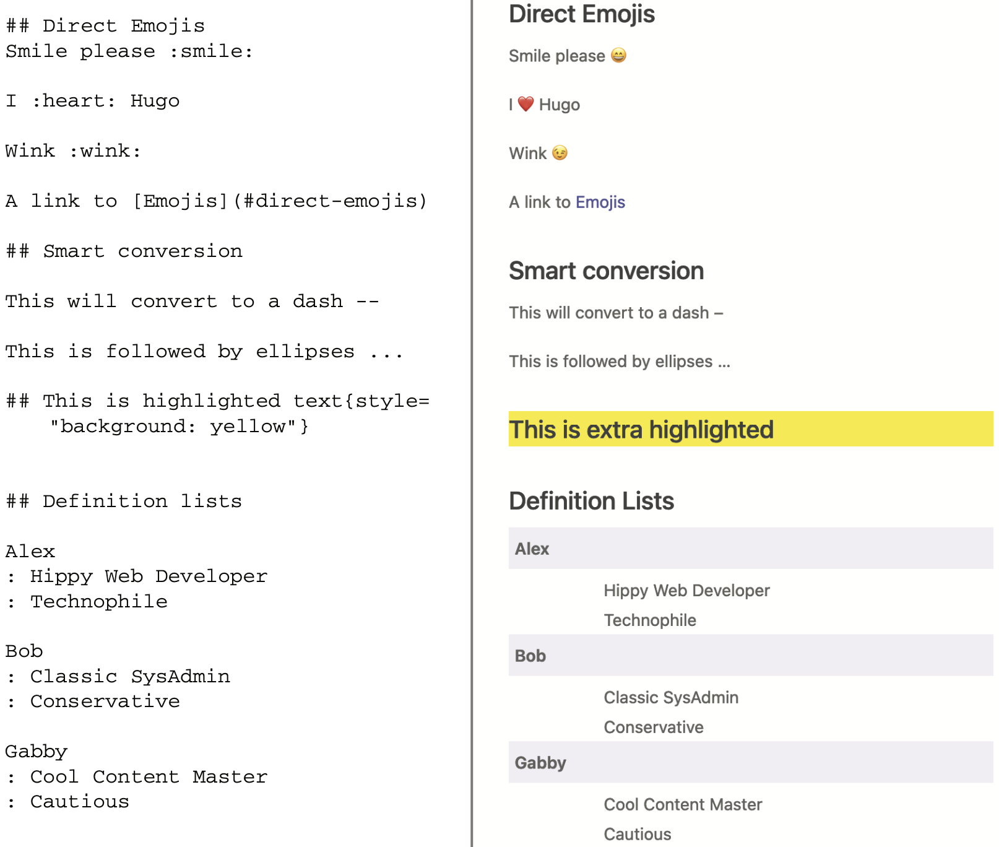
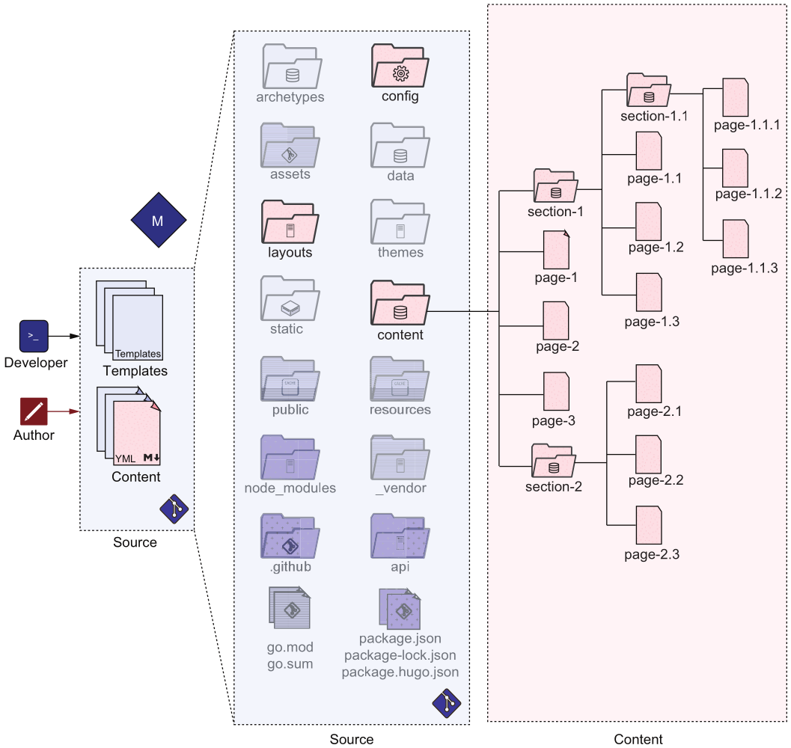

# 常用命令

关闭缓存

```shell
$ hugo server -DEF --noHTTPCache --disableFastRender
```

# _index.md 和 index.md 的区别

[参考](https://gohugo.io/content-management/page-bundles/)

- _index.md: branch bundle, 该会展示该目录下的资源
- index.md: leaf bundle, 只展示该 index.md

# Front Matter

就是在 md 文件开头, 用于描述元信息的数据, 可以是 yaml, json 等

[参考](https://gohugo.io/content-management/front-matter/#front-matter-variables)

```yaml
---
title: "Study Hugo"
date: 2022-07-21T22:14:25+08:00
draft: false
---
```

# jam 含义



- m: Markup, 注意区分 markdown
- j: Javascript
- a: APIs

结合例图来看, Hugo 用 M 和 A (其实是 js, 这里表示应用逻辑) 生成静态文件, 通过 CDN 分发到 Client 后, 可以通过 js
生成动态内容甚至是访问由云提供商开放的 API.

这个 stack 使得用户的维护工作变得很少.

# 目录结构



- archetypes 存放模板
- content 存放数据
- data 存储结构化数据
- layouts 覆盖 theme 的一部分来自定义主题
- themes 渲染 content 中的内容的样式文件
- config Hugo 支持多配置文件, 这时需要组织到一个目录中
- static 建议将内容放到 content, data, themes, layouts 目录中, 而不是 static
    - e.g. 二进制文件, 用于下载的文件
- assets img, js, css
- public Hugo 编译结果输出目录
- resources 相当于缓存目录, 提高编译速度
    - 书中建议版本化该目录, 但是我认为没必要
- go.mod, go.sum Hugo Modules 需要这些文件来管理依赖
- vendor Hugo Modules 用到的第三方依赖
- node_modules, package.json, package-lock.json, package.hugo.json Hugo 和 JS 的集成所用到的文件
- .github, netlify.toml Hugo 持续集成服务所需文件
- api 存放自定义 API

# assets 和 static 的区别

- assets 存放一些需要 Hugo 处理的文件 (Hugo Pipes)
- static 存放不需要 Hugo 处理的文件

# Markdown




- [原始 Markdown 的扩展](https://commonmark.org/ "test tooltip")
- [GFM](https://github.github.com/gfm/) 在扩展之上的 Markdown 变体

Hugo 支持 `.md` `.markdown` 扩展名.

## 语法

启用内联 HTML

```yaml
markup:
  goldmark:
    renderer:
      unsafe: true
```

启用行号

```yaml
markup:
  highlight:
    lineNos: true
```

启用 emoji

- [emoji名字](https://www.unicode.org/emoji/charts/emoji-list.html)

```yaml
# config.yaml
enableEmoji: true
```

使用 emoji

```
:smile:
```







# 内容管理



## 配置管理

如果只用一个配置文件, 那么不能区分开发/生产环境.

## Sections

section 对应 url 路径的一节, 比如 `https://example.org/blog/community/welcome` 中包含 blog, community.
不仅 welcome 可访问, blog 也有 index page 来展示 blog 下的内容的列表.

`content` 目录就是根 section, 可以用 `_index.md` 实现 homepage, 如果使用了主题, 那么在 `_index.md` 中使用
front matter 是不生效的.
- 只有 content section 的 `_index.md` 是可选的

如果想展示目录中的内容, 必须在该目录下创建一个名为 `_index.md` 的空文件, 使该目录成为 section, Hugo 不会自动把目录
变为 section.

