# find_config阶段

## [location指令](https://nginx.org/en/docs/http/ngx_http_core_module.html#location)

### 匹配规则

前缀字符串

- 字符串 前缀匹配
- = 精确匹配
- ^~ 匹配上后不再进行其他location的正则表达式匹配

正则表达式

- ~
- ~*

内部跳转

- @

### 匹配顺序

## [merge_slashes指令](https://nginx.org/en/docs/http/ngx_http_core_module.html#merge_slashes)

# access阶段

## [satisfy指令](https://nginx.org/en/docs/http/ngx_http_core_module.html#satisfy)

access阶段的模块

- access
- auth_basic
- auth_request

执行逻辑

- all, 相当于`&&`
- any, 相当于`||`

# content阶段

## [root指令](https://nginx.org/en/docs/http/ngx_http_core_module.html#root)

## [alias指令](https://nginx.org/en/docs/http/ngx_http_core_module.html#alias)

## [request_filename变量](https://nginx.org/en/docs/http/ngx_http_core_module.html#var_request_filename)

目标文件的绝对路径

## [document_root变量](https://nginx.org/en/docs/http/ngx_http_core_module.html#var_document_root)

由uri和root/alias规则生成的目标文件所在目录的绝对路径

## [realpath_root变量](https://nginx.org/en/docs/http/ngx_http_core_module.html#var_realpath_root)

将document_root中的软链接等换成真实路径

## [types指令](https://nginx.org/en/docs/http/ngx_http_core_module.html#types)

## [default_type指令](https://nginx.org/en/docs/http/ngx_http_core_module.html#default_type)

## [types_hash_bucket_size指令](https://nginx.org/en/docs/http/ngx_http_core_module.html#types_hash_bucket_size)

## [types_hash_max_size指令](https://nginx.org/en/docs/http/ngx_http_core_module.html#types_hash_max_size)

## [log_not_found指令](https://nginx.org/en/docs/http/ngx_http_core_module.html#log_not_found)

## [server_name_in_redirect](https://nginx.org/en/docs/http/ngx_http_core_module.html#server_name_in_redirect)

- on 返回的重定向url的域名为server_name指令中的主域名

## [port_in_redirect](https://nginx.org/en/docs/http/ngx_http_core_module.html#port_in_redirect)

- on 重定向中的url带port

## [absolute_redirect](https://nginx.org/en/docs/http/ngx_http_core_module.html#absolute_redirect)

- off 返回重定向url时, 不带域名
- on 带域名, 如果请求中有Host头部, 则重定向url的域名为Host所指定的域名
