查看某key的内部编码

```bash
redis> RPUSH lst 1 3 5 10086 "hello" "world"
(integer)6
redis> OBJECT ENCODING lst
"ziplist"
```

- [raw]()
- [embstr]()
- [hashtable]()
- [linkedlist]()
- [ziplist]()
- [intset]()
- [skiplist]()