# 延长syn, accept队列

- 应用层connect超时时间
- 操作系统内核
  - 服务器端syn_rcv状态
    - net.ipv4.tcp_max_syn_backlog: syn_rcvd状态连接的最大个数
    - net.ipv4.tcp_synack_retries: 被动建立连接时, 发syn/ack的重试次数
  - 客户端syn_ent状态
    - net.ipv4.tcp_syn_retries = 6 主动建立连接时, 发syn的重试次数
    - net.ipv4.ip_local_port_range = 32768 60999 建立连接时的本地端口可用范围
  - accept队列设置

# Fast Open降低时延

[TFO]()

Linux上打开TFO

net.ipv4.tcp_fastopen

- 0: 关闭
- 1: 作为客户端时可以使用TFO
- 2: 作为服务器时可以使用TFO
- 3: 无论作为客户端还是服务器, 都可以使用TFO

# TCP_DEFER_ACCEPT

服务端收到客户端发来的数据后才唤醒阻塞在accept()的应用