## 1.1 x86通用寄存器

32位x86是intel推出的,64位x86_64是amd推出的(amd64)

### 1.1.1 32位架构

在汇编中使用名称来引用寄存器.

表1-1 Intel指令编码中8个通用寄存器的编号和名称
编号|名称|编号|名称
-|-|-|-
0 | EAX | 4 | ESP
1 | ECX | 5 | EBP
2 | EDX | 6 | ESI
3 | EBX | 7 | EDI

0~3号寄存器可以拆分

图1-1 EAX寄存器的结构


表1-2 编号为0～3的寄存器的结构设计
32位|16位|高8位|低8位
-|-|-|-
EAX | AX | AH | AL
ECX | CX | CH | CL
EDX | DX | DH | DL
EBX | BX | BH | BL

4~7号寄存器没有8位独立名称

表1-3 编号为4～7的寄存器的结构设计
32位|16位|32位|16位
-|-|-|-
ESP | SP | ESI | SI
EBP | BP | EDI | DI

通用寄存器的特殊用途
- EAX寄存器会被乘法和除法指令自动使用，通常称为扩展累加寄存器。
- ECX被LOOP系列指令用作循环计数器，但是多数上层语言不会使用LOOP指令，一般通过条件跳转系列指令实现。
- ESP用来寻址栈上的数据，很少用于普通算数或数据传输，通常称为扩展栈指针寄存器。
- ESI和EDI被高速内存传输指令分别用来指向源地址和目的地址，被称为扩展源索引寄存器和扩展目标索引寄存器。
- EBP在高级语言中被用来引用栈上的函数参数和局部变量，一般不用于普通算数或数据传输，称为扩展帧指针寄存器。

EFLAGS标志寄存器
- 汇编语言中用于比较的CMP和TEST会修改标志寄存器里的相关标志，再结合条件跳转系列指令，就能实现上层语言中的大部分流程控制语句

EIP指令指针寄存器
- 存储的是下一条将要被执行的指令的地址，而且汇编语言中不能通过名称直接引用EIP，只能通过跳转、CALL和RET等指令间接地修改EIP的值。

### 1.1.2 64位架构

64位架构把通用寄存器的个数扩展到16个，之前的8个通用寄存器也被扩展成了64位，每个寄存器的低8位、16位、32位都可以单独使用。

表1-4 64位架构下16个通用寄存器的结构设计
64位|32位|16位|8位
-|-|-|-
RAX | EAX | AX | AL
RCX | ECX | CX | CL
RDX | EDX | DX | DL
RBX | EBX | BX | BL
RSP | ESP | SP | SPL
RBP | EBP | BP | BPL
RSI | ESI | SI | SIL
RDI | EDI | DI | DIL
R8~R15 | R8D~R15D | R8W~R15W | R8B~R15B

指令指针EIP被扩展为64位的RIP，但依然不能在代码中直接引用。标志寄存器EFLAGS被扩展为64位的RFLAGS，里面的标志位保持向前兼容。

## 1.2 常用汇编指令

x86的汇编指令一般由一个opcode（操作码）和0到多个operand（操作数）组成，大多数指令包含两个操作数，一个目的操作数和一个源操作数。

### 1.2.1 整数加减指令

源操作数可以是寄存器, 内存, 立即数, 目的操作数可以是寄存器, 内存. **两个操作数不能同时为内存**

```
ADD EAX, 16 ; EAX = EAX + 16
SUB ESP, 32 ; ESP = ESP - 32

ADD AL, CL
ADD AX, CX
```

### 1.2.2 数据传输指令

MOV指令主要用来在寄存器之间及寄存器和内存之间传输数据，也可以用来把一个立即数写到寄存器或内存中。

```
MOV EAX, ECX  ; EAX = ECX
MOV EDX, 1234 ; EDX = 1234
```

内存寻址方式
- Displacement：位移，是一个8位、16位或32位的值。
- Base：基址，存放在某个通用寄存器中。
- Index：索引，存放在某个通用寄存器中，ESP不可用作索引。
- Scale：比例因子，用来与索引相乘，可以取值1、2、4、8。经过计算得到的地址称为有效地址。

```
Effective Address = Base + (Index x Scale) + Displacement (1-1)
```

基于Base和Displacement的寻址
- 位移(Displacement)：一个单独的位移表示距离操作数的直接偏移量。因为位移被编码在指令中，所以一般用于编译阶段静态分配的全局变量之类。
- 基址(Base)：将内存地址存储在某个通用寄存器中，寄存器的值可以变化，所以一般用于运行时动态分配的变量、数据结构等。
- 基址＋位移(Base＋Displacement)：基址加位移，尤其适合寻址运行时动态分配的数据结构的字段，以及函数栈帧上的变量。

```
MOV EAX, [16]       ; 位移
MOV EAX, [ESP]      ; 基址
MOV EAX, [ESP + 16] ; 基址 + 位移
```

### 1.2.3 入栈和出栈指令

```
PUSH EAX
; 等价于
SUB ESP, 4
MOV [ESP], EAX
```

```
POP EAX
; 等价于
MOV EAX, [ESP]
ADD ESP, 4
```

### 1.2.4 分支跳转指令

JMP指令会修改EIP的值
- 只有一个操作数, 可以是立即数, 通用寄存器, 内存位置

```
JMP 32
JMP EAX
JMP [EAX+32]
```

### 1.2.5 过程调用指令

可以认为CALL在JMP的基础上多了一步记录返回地址的操作
- CALL指令先把返回地址入栈，然后跳转到目的地址执行

目的地址也可以经由一个立即数、通用寄存器或内存位置来给出。

```
CALL EAX
; 等价于
PUSH 32
JMP EAX
```

子过程执行完成后通过RET指令返回，RET指令会从栈上弹出返回地址，并跳转到该地址处继续执行。
- RET 可以不带参数

```
RET 8
; 等价于
RET
ADD ESP, 8
```

## 1.3 内存分页机制

在分页模式下，应用程序中使用的地址被称为线性地址，需要由MMU(Memory Management Unit)基于页表映射转换为物理地址，整个转换过程对于应用程序
是完全透明的。

### 1.3.2 80386两级页表

- 每个页面4KB, 地址总线32bit, 物理地址32bit
- 每个页面存1024个地址 = 4KB/32bit(4B) = 1K

图1-2 80386线性地址到物理地址的转换


### 1.3.3 PAE三级页表

Physical Address Extension，PAE 物理地址扩展

- PAE地址总线36bit, 使硬件能够寻址64GB
- 仍使用32bit线性地址宽度(进程地址空间大小不变)
- 每个页面4KB, PAE地址总线36bit, 物理地址64bit
- 每个页面存储512个地址 = 4KB/64bit(8B) = 0.5K

图1-3 PAE线性地址到物理地址的转换


### 1.3.4 x64四级页表

Intel推出的IA64架构因为与原来的x86架构不兼容，所以没能普及，而AMD公司通过扩展x86推出的x64架构，因为良好的向下兼容性而被广泛采用。常见的
x64、x86_64都是指amd64架构，如今的个人计算机基本是基于amd64架构的。

在amd64上，寄存器的宽度变成了64位，而线性地址实际只用到48位，也就是最大可寻址256TB的内存。很少有单台计算机会安装如此大量的内存，所以没有必
要实现48位的地址总线，常见的个人计算机的CPU的地址总线实际还不到40位，例如笔者的计算机的Core i7实际只有36位。服务器的CPU的地址总线的宽度会
更大，例如Xeon E5系列能达到46位。

- 每个页面4KB, 地址总线48bit, 物理地址64bit
- 每个页面存储512个地址 = 4KB/64bit(8B) = 0.5K


### 1.3.5 虚拟内存

> 猜测前面的地址转换图中的CR3是每个进程页表的起始物理地址

进程是以页面为单位向操作系统申请内存的，操作系统一般只是对进程已申请的区间进行记账，并不会立刻映射所有页面。等到进程真正去访问某个未映射的页
面时，才会触发Page Fault异常，操作系统注册的Page Fault Handler会检查内存记账：如果目标地址已申请，就是合法访问，系统会分配一个物理页面并
完成映射，然后恢复被中断的程序，程序对这一切都是无感的；如果目标地址未申请，就是非法访问，系统一般会通过信号、异常等机制结束目标进程。

当物理内存不够用的时候，操作系统可以把一些不常使用的物理页面写到磁盘交换分区或交换文件，从而能够将空出的页面给有需要的进程使用。当被交换到磁
盘的页面再次被访问时，也会触发Page Fault，由Page Fault Handler负责从交换分区把数据加载回内存。程序对这一切都是无感的，并不知道某个内存页
面到底是在磁盘上，还是在物理内存中，所以称为**进程的虚拟内存**。


## 1.4 汇编代码风格

1.操作数的宽度

在Go汇编中通过指令的后缀来判断操作数的宽度，后缀W代表16位，后缀L代表32位，后缀Q代表64位，不像Intel汇编中有AX、EAX、RAX不同的寄存器名称。
例如对于整数自增指令，Intel汇编风格的代码如下：

```
INC EAX
INC RCX
```

对应的Go汇编风格的代码如下：

```
INCL AX
INCQ CX
```

2.操作数的顺序

对于常见的有两个操作数的指令，Go汇编中操作数的顺序与Intel汇编中操作数的顺序是相反的，源操作数在前而目的操作数在后。

例如Intel汇编的代码如下：

```
MOV EAX, ECX
```

转换成Go汇编的代码如下：

```
MOVL CX, AX
```

3.地址的表示

有效地址的计算公式如式(1-1)所示，如果要用ESP作为基址寄存器，EBX作为索引寄存器，比例系数取2，位移为16，则可以分别给出两种风格的代码。

Intel汇编的代码如下：

```
[ESP + EBX*2 + 16]
```

Go汇编的代码如下：

```
16(SP)(BX*2)
```

4.立即数格式

Go汇编中的立即数类似于AT&T风格的立即数，需要加上$前缀。

Intel汇编的代码如下：

```
MOV EAX, 1234
```

Go汇编的代码如下：

```
MOVL $1234, AX
```


## 1.5 本章小结
